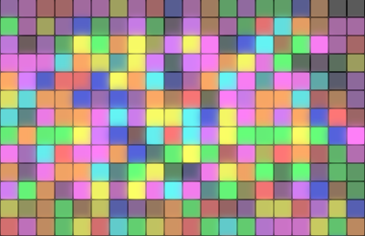

<h1 align="center">Hover-Board</h1>
<h2 align="center">

</h2>

<h3 align="center">
    <a href="https://hover-boarddd.netlify.app/" target="_blank">Life Demo</a>
</h3>

### Description
___
This project represents a drawing board on which squares light up when you move the mouse cursor(or you touch the board with your finger) The square returns to its previous color after 3 seconds

The game is created with native JS and CSS, without any frameworks and libraries. 

### How it works
___

Using event listeners in js, we give a random color to the square on which the cursor is positioned:
`square.addEventListener('mouseover', () => setColor(square))`;
`square.addEventListener('mouseleave', () => removeColor(square))`

### Additionally
___

I've learned myself web development without any courses or training, so if you have any comments, I will be happy to chat with you on social networks (see  my <a href="https://github.com/liyakot">profile</a> :fire:)
